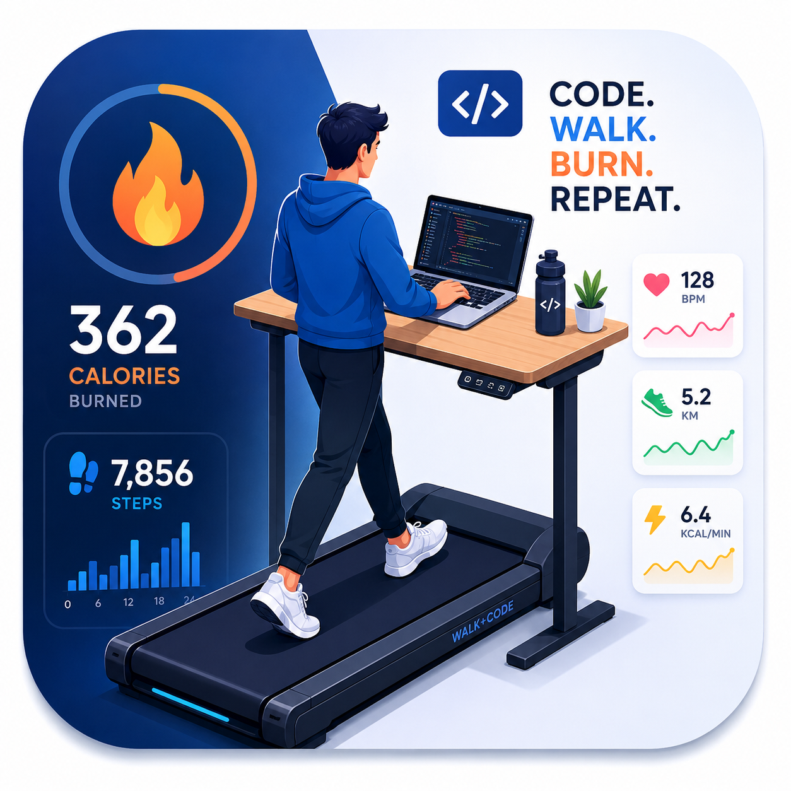

# Treadmill Buddy



Treadmill Buddy is a JetBrains IDE plugin for developers who use an under-desk treadmill while they work. It keeps a digital stopwatch inside the IDE, estimates calories, tracks distance and steps, and helps you save walking sessions without leaving your coding flow.

## What It Does

- Opens a `Treadmill Buddy` tool window inside the IDE.
- Works in metric (km/h, kg, cm) or imperial (mph, lb, in) units — switchable any time in settings; stored data converts automatically.
- Shows a large seven-segment digital clock for workout time (light and dark theme aware).
- Adds a status bar widget with live time and calories; click it for a quick-actions menu.
- Offers a movable floating clock with `Pause` / `Resume`, `Save`, and `Pinned` / `Unpinned` (always on top) controls; position and pin state are remembered. It opens with a session until you close it; the `Float Clock` button brings it back and re-enables the automatic opening.
- Saves sessions so you can pause, resume, load, reset, or delete them later (deletion and reset are undoable from the notification).
- Tracks elapsed time, countdown time, distance, steps, calories, incline, and targets.
- Shows today / last-7-days / all-time totals, a 14-day distance chart, a six-month activity heatmap, and your walking-day streak (with 0-6 configurable rest days per week and an evening "streak at risk" hint).
- Stores session history in `~/.treadmill-buddy/sessions.json`, shared across all JetBrains IDEs and safe across IDE reinstalls. Writes take a cross-process lock, so IDEs saving at the same moment never lose each other's walks; a session resumed or deleted in another IDE shows up here on the next focus, and a history file that cannot be parsed is set aside rather than overwritten.
- Exports session history to CSV or JSON, imports both back (JSON restores the full model including speed segments), and exports single sessions as TCX workouts with per-minute trackpoints for Garmin Connect, Strava, and similar services (they arrive as a generic workout you can relabel as a walk, because the TCX format has no walking sport).
- Supports optional daily and weekly goals (steps, distance, or calories) with progress bars, a status bar progress glyph, and a congratulation notification when you hit them.
- Lets you save named speed presets and switch between them with one click; multi-speed sessions get a per-speed breakdown tooltip.
- Tracks personal records (longest session, best day distance and steps) and notifies you when you break one.
- Updates countdown estimates live when speed, incline, or calorie algorithm changes.
- Auto-pauses after keyboard and mouse inactivity, then resumes when typing starts again; a `Keep Running While Idle` toggle suspends this for reading-heavy walking or meetings.
- Optionally reminds you to move after a configurable sitting time.
- Provides IDE actions (`Start/Pause Treadmill Session`, `New Treadmill Session`, ...) in the Tools menu, the tool window title bar, and Find Action, so you can bind keyboard shortcuts.
- Keeps one shared workout running across all open project windows — timing is wall-clock based, so a busy IDE never shortens your session.
- Stores profile and default settings in IDE settings.

## Session Modes

`Marathon`

Counts up from `00:00:00`. Use it for open-ended treadmill work sessions where you want to track time, distance, steps, and calories as you go.

`Calorie burn`

Counts down from the estimated time needed to burn a calorie target. Enter calories and treadmill speed, and the clock previews the required time before you start.

`KG burn`

Counts down from the estimated time needed to burn a target body mass (kg, or lb in imperial mode). If the goal would require more than 99 days, the plugin nudges you toward a smaller goal first.

`Interval walk`

Alternates walking and break blocks (for example 25 minutes walking, 5 minutes standing) with a chime and notification at each switch. The clock counts down the current block; distance, steps, and calories accumulate only while walking.

## Calorie Algorithms

Treadmill Buddy includes four calorie-estimation models:

- `ACSM treadmill (default)`: uses the widely referenced ACSM walking/running oxygen-cost equations, including the incline term when you set an incline.
- `Compendium MET gross`: uses speed bands from the Compendium of Physical Activities and includes resting energy.
- `Compendium MET active`: uses Compendium MET speed bands minus 1 MET for a conservative active-calorie estimate.
- `Distance cost per km`: estimates calories from common cost-of-transport values per kg per kilometer.

Each algorithm has a hover tooltip in the UI. The default algorithm can be changed from `Settings | Tools | Treadmill Buddy`.

## Settings

On first IDE startup, Treadmill Buddy shows a notification inviting you to set up:

- Units (metric or imperial)
- Weight (kg or lb)
- Height (cm or in)
- Default calorie algorithm
- Auto-pause timeout
- Move-reminder interval
- Optional daily and weekly goals (steps, distance, or calories)
- Streak rest days per week (0-6)
- The hour from which a walk-free day shows the "streak at risk" hint

You can edit everything later from `Settings | Tools | Treadmill Buddy`; switching units converts the displayed values on the spot, and all stored data stays metric internally, so nothing is lost by switching back and forth.

- The auto-pause timeout defaults to `10` minutes; `0` disables auto-pause.
- The move reminder is off (`0`) by default; set it to e.g. `60` to get a nudge after an hour without walking.
- The daily goal is `None` by default. Pick steps, distance, or calories and a value; the tool window then shows a progress bar for today, and you get a one-time notification each day you reach the goal.
- Only data that actually feeds the calorie models is collected — weight and height.

## Workout Behavior

- Changing treadmill speed or incline during a workout updates future distance, calorie, and countdown estimates.
- Pending timer ticks are settled before speed, incline, or calorie algorithm changes, so elapsed activity keeps its previous rate.
- Resuming preserves recorded step totals. Height changes affect only newly estimated steps, and fractional steps survive saves and restarts.
- Switching display units preserves the exact workout speed until you edit it.
- Profile measurements, distance goals, and weight targets also retain their exact metric values across repeated unit switches.
- Start, Resume, Save for a paused session, and previews use the same input validation. Invalid inputs leave a paused session paused.
- Calorie, weight, and interval targets can be edited while paused and apply on Resume or Save. Changing interval lengths starts a new walking block without clearing recorded totals; interval lengths use whole minutes.
- Paused edits merge with newer saved activity from another IDE: only fields you changed override its configuration, while its recorded progress is retained.
- Small positive goals use extra decimal places when needed, so switching units never rounds them to an invalid zero.
- Changing calorie algorithm during `Calorie burn` or `KG burn` updates the remaining countdown time.
- Invalid speed, incline, or target values are flagged inline on the field as you type.
- Speeds above `20 km/h` show the warning: `slow down coyote beep beep!!`
- Keyboard and mouse activity keep the session alive; after the idle timeout it auto-pauses, and typing resumes it (a lone modifier key such as Shift does not count as typing).
- If the machine goes to sleep, the session auto-pauses instead of crediting the slept time.
- Pause and Resume preserve partial seconds, including after loading a session or restarting the IDE.
- New walking activity is recorded by day, so resuming an older session or walking across midnight contributes to the correct daily goals, charts, and streaks. Historical walks without a daily breakdown keep their original creation-date attribution.
- If another IDE holds the history lock, pending saves and deletions are retried in the background; the plugin never writes without the lock. Brief contention is retried quietly, a warning appears only when the lock stays busy, and closing the IDE waits up to two seconds for it.
- The 30-second autosave writes the history file on a background thread, so a long history never stalls the editor.
- Starting a new session, switching mode, or loading another session while one is running pauses and saves the running one first, so no walked time is lost. `New` leaves the clock empty, also after a restart or when the tool window opens in another project.
- `Reset` on a session with walked time asks for confirmation, because it clears that walk from the history; the notification offers an undo, which works even after the clock was started again.
- Number fields accept `1.5` and `1,5`. Thousands separators work where they cannot be misread (`10,000` steps, `1,234.5`); a decimal field flags an ambiguous `1,500` and suggests `1500` or `1.5`.
- Session completion shows a notification (no modal dialog interrupting your typing).
- Saved sessions appear in a list with duration, distance, calories, and date; double-click or press Enter to load one, use the toolbar to delete, import CSV/JSON, or export sessions as CSV, JSON, or TCX. The list shows the 25 most recent sessions with a Show All toggle, and refreshes when the IDE regains focus so walks saved in another JetBrains IDE appear immediately.
- The CSV export always uses metric columns (`speed_kmh`, `distance_km`), regardless of the display units, so exported data stays comparable, and re-importing skips sessions you already have. Modes and algorithms are written as stable ids (`CALORIE_BURN`, `ACSM_FLAT`); older exports with English labels still import.
- CSV names can contain commas, quotes, and line breaks. Malformed quoting rejects the import before any sessions are saved.
- History cleanup uses the latest recorded activity date and keeps the session currently on the clock, including while paused.
- TCX exports use speed segments when they cover the whole workout; sessions with incomplete speed histories use evenly interpolated distance across the full duration.

## Build and Development

```powershell
./gradlew buildPlugin    # builds the installable ZIP under build/distributions
./gradlew runIde         # launches a sandbox IDE with the plugin installed
./gradlew test           # runs the unit tests
./gradlew verifyPlugin   # runs the IntelliJ Plugin Verifier
```

The project targets IntelliJ Platform 2024.3+ (`sinceBuild 243`) and only depends on `com.intellij.modules.platform`, so it runs in IntelliJ IDEA, PyCharm, WebStorm, and every other JetBrains IDE. Building needs a Java 21 JDK, the version the 2024.3 platform is compiled for; Gradle picks one up from the usual locations. `buildPlugin` also indexes the settings page for Settings search, which starts a headless IDE once. The verifier checks IntelliJ IDEA Community 2024.3 through 2025.2 and the unified IntelliJ IDEA from 2025.3 on; Community is not published after 2025.2.

Source layout: `engine` holds the workout clock and its trackers (goals, records, move reminders), `storage` the shared history file, `transfer` the CSV/JSON/TCX formats, `settings` the IDE settings and their forms, and `ui` the tool window, status bar widget, and floating clock.

## Releasing

Release notes are maintained in the [plugin descriptor](src/main/resources/META-INF/plugin.xml); pending changes appear under Unreleased until the next version is prepared.

Pushing a `v*` tag runs the release workflow, which builds, signs, and publishes the plugin to JetBrains Marketplace. It needs these repository secrets: `PUBLISH_TOKEN` (Marketplace permanent token), `CERTIFICATE_CHAIN`, `PRIVATE_KEY`, and `PRIVATE_KEY_PASSWORD` (plugin signing, see the [JetBrains signing guide](https://plugins.jetbrains.com/docs/intellij/plugin-signing.html)).

## License

Treadmill Buddy is licensed under the [Apache License 2.0](LICENSE).
